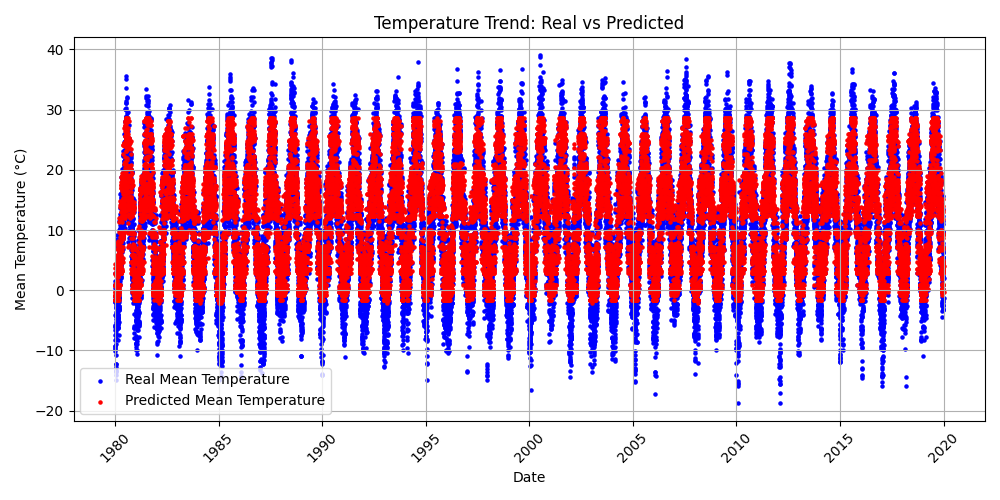
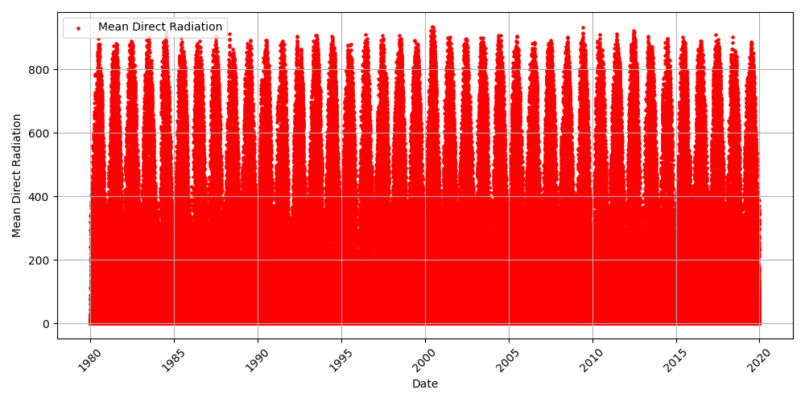
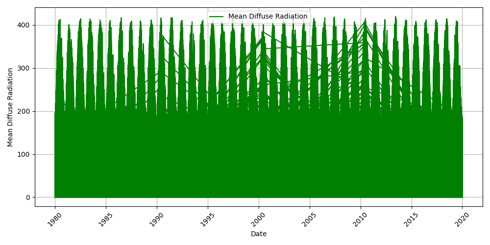

# Weather Prediction Report

## Summary
This project uses PySpark to analyze and predict temperature trends based on weather data.

## Results
### Temperature Trend

### Mean Direct Radiation Trend

### Mean Diffuse Radiation Trend

### Model Performance
