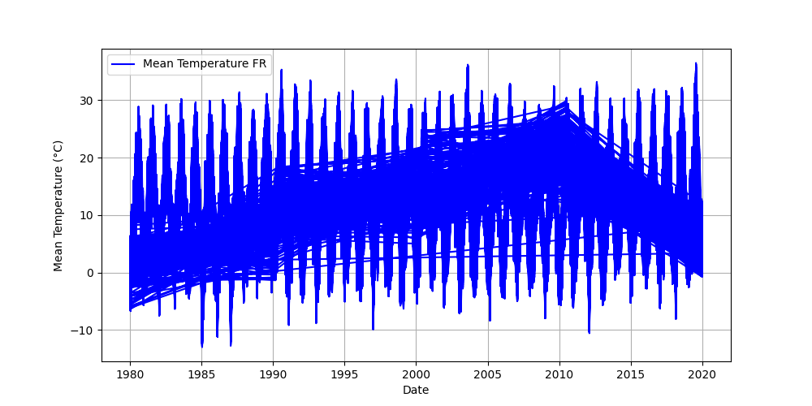
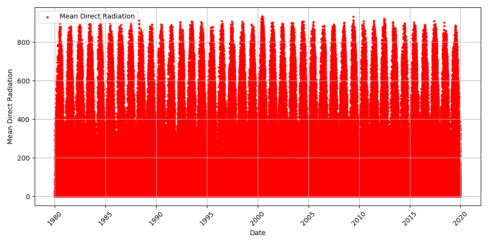
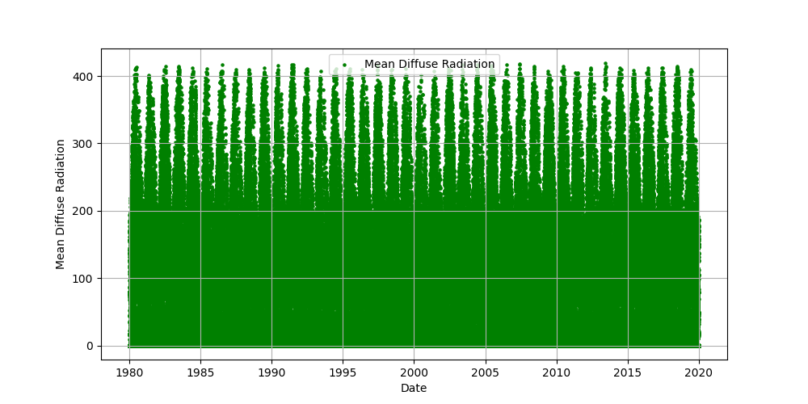

# Weather Prediction Report

## Summary
This project uses PySpark to analyze and predict temperature trends based on weather data.

## Results
### Mean Temperature Trends

### Mean Direct Radiation Trends

### Mean Diffuse Radiation Trends

### Model Performance
