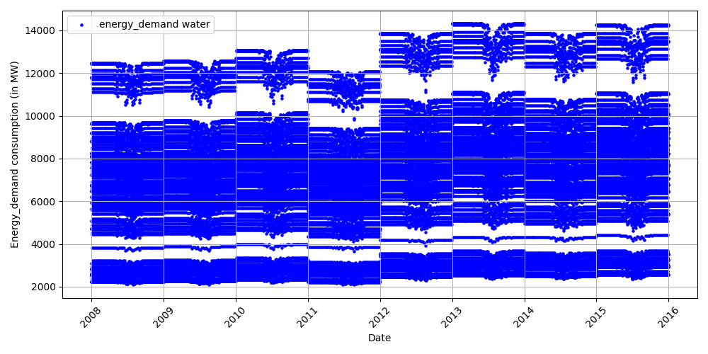
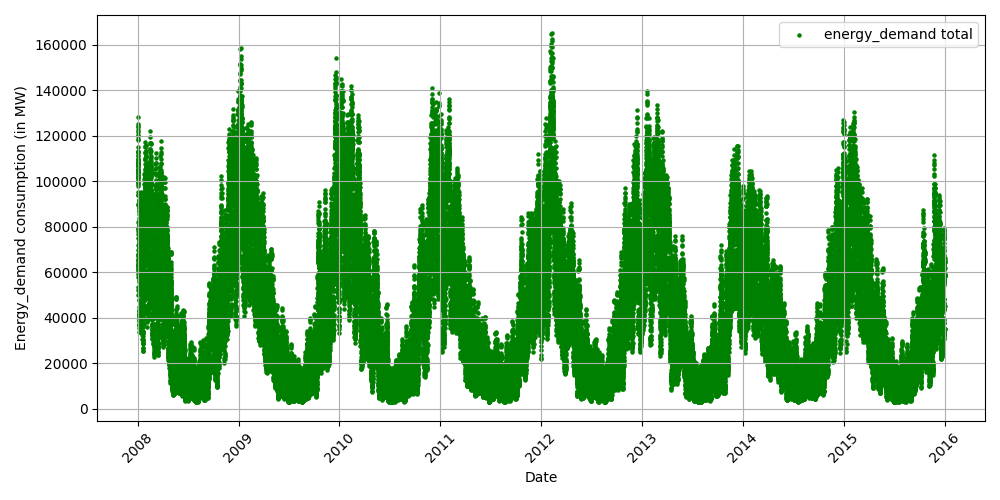

# Energy demand Report

## Summary
This project uses PySpark to analyze and predict Energy demand in France.

## Results
### Energy water

### Energy space

### Energy total

### Model Performance

## Alerts
The following alerts were detected:
|      | timestamp           |   energy_demand_total |   prediction |   error |
|-----:|:--------------------|----------------------:|-------------:|--------:|
|  879 | 2008-12-30 08:00:00 |                131339 |       116629 | 14710.2 |
|  890 | 2009-01-06 05:00:00 |                127537 |       116395 | 11142.1 |
|  891 | 2009-01-06 08:00:00 |                147644 |       116395 | 31249.1 |
|  892 | 2009-01-07 16:00:00 |                135020 |       115832 | 19188.5 |
|  893 | 2009-01-07 19:00:00 |                134785 |       115236 | 19549.4 |
|  894 | 2009-01-08 05:00:00 |                128464 |       116395 | 12069.1 |
|  895 | 2009-01-08 18:00:00 |                134482 |       115236 | 19246.4 |
|  896 | 2009-01-09 10:00:00 |                137379 |       115501 | 21877.8 |
|  897 | 2009-01-09 14:00:00 |                127249 |       115832 | 11417.5 |
|  898 | 2009-01-09 15:00:00 |                129724 |       111799 | 17924.6 |
|  899 | 2009-01-10 17:00:00 |                130753 |       115236 | 15517.4 |
|  902 | 2009-01-12 08:00:00 |                132510 |       116629 | 15881.2 |
| 1719 | 2009-12-16 09:00:00 |                135817 |       115970 | 19847   |
| 1721 | 2009-12-17 17:00:00 |                130222 |       115236 | 14986.4 |
| 1725 | 2009-12-18 15:00:00 |                124734 |       111799 | 12934.6 |
| 1727 | 2009-12-19 11:00:00 |                128712 |       115236 | 13476.4 |
| 1732 | 2009-12-21 08:00:00 |                132512 |       116629 | 15883.2 |
| 1777 | 2010-01-05 06:00:00 |                137991 |       125713 | 12277.9 |
| 1783 | 2010-01-07 08:00:00 |                138710 |       116395 | 22315.1 |
| 1794 | 2010-01-12 06:00:00 |                139544 |       125713 | 13830.9 |
| 1865 | 2010-02-11 08:00:00 |                136433 |       116395 | 20038.1 |
| 1868 | 2010-02-12 08:00:00 |                137129 |       116395 | 20734.1 |
| 1869 | 2010-02-12 10:00:00 |                126054 |       115970 | 10084   |
| 1871 | 2010-02-13 06:00:00 |                140161 |       125713 | 14447.9 |
| 1878 | 2010-02-16 08:00:00 |                129593 |       116395 | 13198.1 |
| 2657 | 2011-01-04 08:00:00 |                126310 |       115970 | 10340   |
| 3618 | 2012-02-02 17:00:00 |                130092 |       115236 | 14856.4 |
| 3619 | 2012-02-03 09:00:00 |                143134 |       116395 | 26739.1 |
| 3621 | 2012-02-04 09:00:00 |                139468 |       116395 | 23073.1 |
| 3623 | 2012-02-05 09:00:00 |                135215 |       115970 | 19245   |
| 3624 | 2012-02-05 17:00:00 |                136034 |       115236 | 20798.4 |
| 3626 | 2012-02-07 13:00:00 |                128668 |       115236 | 13432.4 |
| 3627 | 2012-02-07 16:00:00 |                137075 |       115236 | 21839.4 |
| 3630 | 2012-02-09 16:00:00 |                136115 |       115236 | 20879.4 |
| 3632 | 2012-02-10 08:00:00 |                150510 |       116395 | 34115.1 |
| 3633 | 2012-02-10 18:00:00 |                135487 |       115236 | 20251.4 |
| 3634 | 2012-02-11 15:00:00 |                125510 |       115236 | 10274.4 |
| 3635 | 2012-02-12 10:00:00 |                130538 |       115501 | 15036.8 |
| 3636 | 2012-02-12 20:00:00 |                130769 |       115501 | 15267.8 |